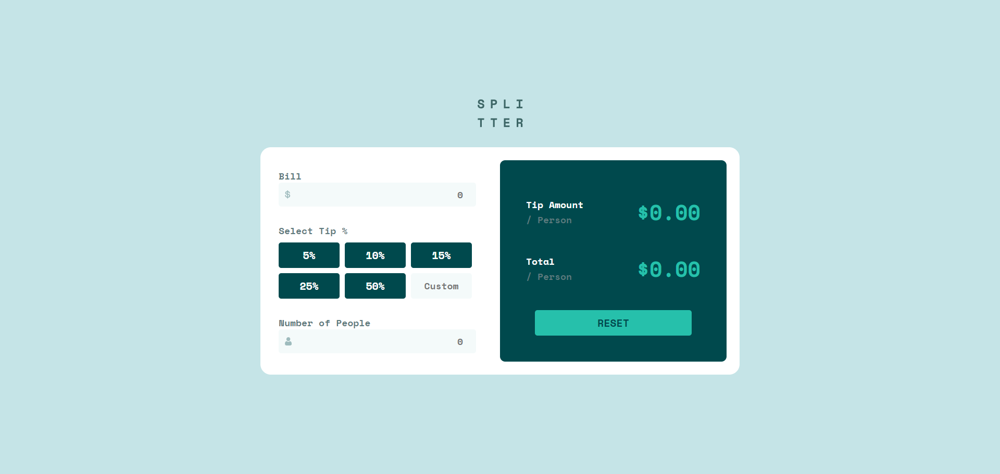

# pablodev - Tip calculator app solution

This is a solution to the [Tip calculator app challenge on Frontend Mentor](https://www.frontendmentor.io/challenges/tip-calculator-app-ugJNGbJUX). Frontend Mentor challenges help you improve your coding skills by building realistic projects.

### notes of coder in PT-BR
*Boa noite, galera!*

*Sinto que fiquei um pouco distante das minhas obrigações nesse meio tempo, estava um pouco enferrujado neste solução, precisei de uma certa ajuda de documentações e outras soluções, apesesar de não ter copiado uma linha de código por não concordar com a metodologia usada*

*Sinto que poderia ter dado um pouco mais de mim para essa solução, mas é gostoso saber que estou tentando.*

### Screenshot

### Links

- Solution URL: [Repositore](https://github.com/Pabloodev/tip-calculator)
- Live Site URL: [Live site](https://pabloodev.github.io/tip-calculator/)

### Continued development

I intend to continue learning the frontend triad, but my goal is to become a professional in Python, so it is possible for me to divide my attention a little.

## Author

- Website - [Pablo Teixeira](https://www.pabloteixeira.com)
- Frontend Mentor - [@pabloodev](https://www.frontendmentor.io/profile/pabloodev)

